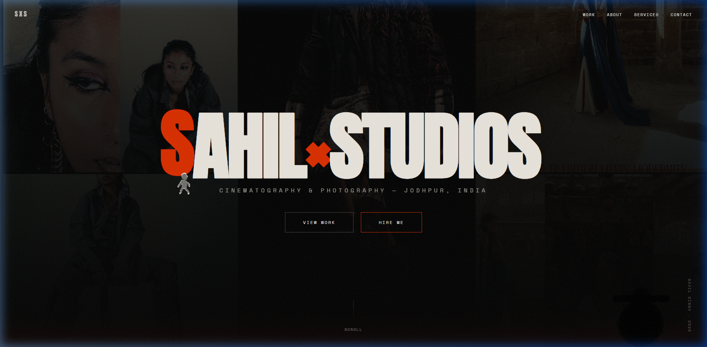
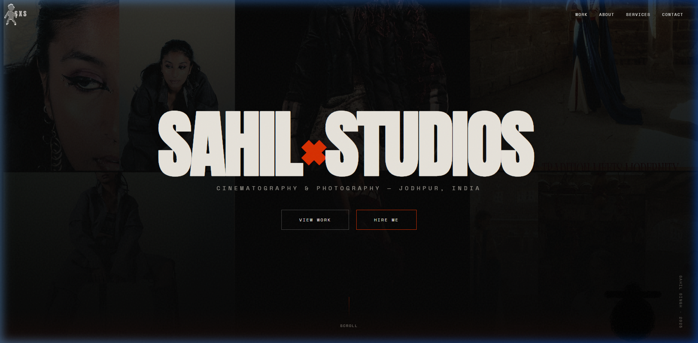
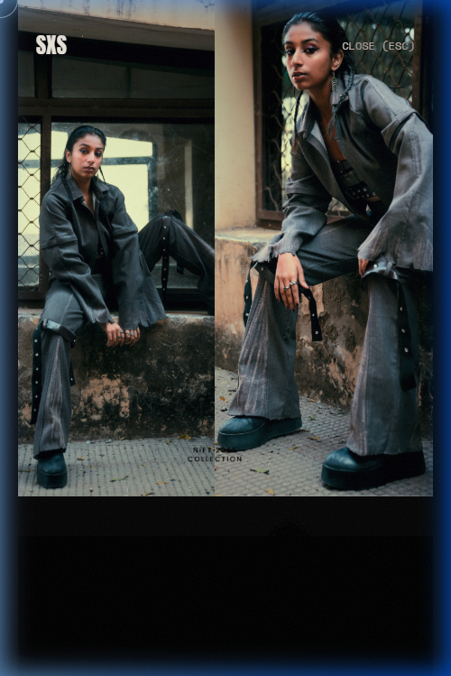
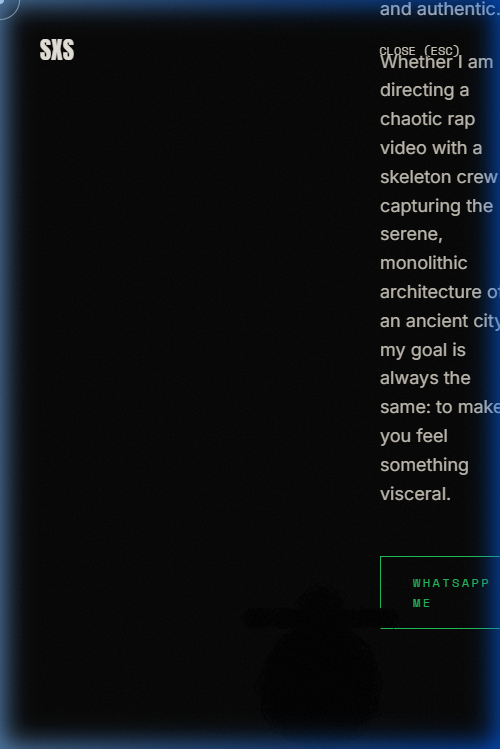
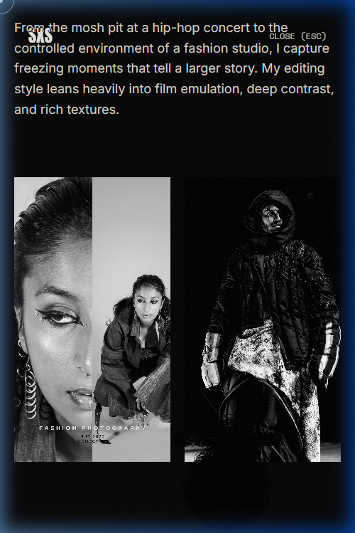

# SAHILXSTUDIOS - Portfolio Website

A highly interactive, brutalist, and cinematography-focused portfolio website built with React, Vite, Framer Motion, and React Three Fiber. High-contrast digital brutalism—emulating film stocks while pushing the boundaries of modern digital sensors.

## Features & Implementation

### 1. Custom Interactive Cursor
Replaced the standard cursor with a completely bespoke SVG "scribbly cameraman" using advanced `<feTurbulence>` displacement filters to create a deeply chaotic ink aesthetic matching the 3D model.
- **Trailing Effect:** Moving the cursor leaves a sweeping trail mapped to an array of lagged coordinates.
- **Hover State:** When hovering over clickable elements, the SVG seamlessly transitions into a separate "clicking a photo" state.

### 2. Chaotic Page Transitions & Routing
The single-page application is structured with `react-router-dom` incorporating `/project/:id`, `/service/:id`, and `/about` subpages. 
Transitions between these routes feature a chaotic spider-web wipe animation using dense SVG paths and `framer-motion`'s `pathLength` property to aggressively "mask" the screen.

### 3. Interactive WebGL Character
Embedded a 3D wireframe character model (`personnage_opti.glb`) using `@react-three/fiber` in the corner. The camera and scene lighting dynamically track mouse movement, shifting perspective as the user scrolls.

### 4. Advanced UI Interactions
- **Magnetic Buttons:** Custom magnetic physics on buttons to snap toward the user's cursor.
- **Scroll Hijacking:** Buttery smooth scrolling matching Awwwards-winning standards via Lenis.
- **Loading Sequence:** A 2.2s loader with progress bar, exiting with a dense, staggered black-lines wipe transition.
- **Dynamic Headers:** Frosted-glass on scroll.

### 5. Deployment
The site is production-ready and deployed to Netlify. A `_redirects` file configures the SPA routing cleanly on the CDN.

## Technologies Used
- React 18 & Vite
- Framer Motion (Animations & Page Wipes)
- React Three Fiber & Drei (WebGL 3D Model Rendering)
- React Router Dom (Routing)
- Lenis (Smooth Scrolling)

## Local Development
1. Clone the repository
2. Run `npm install`
3. Run `npm run dev` to start the local server.
